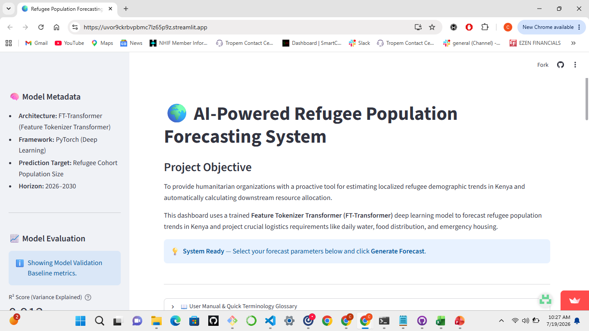
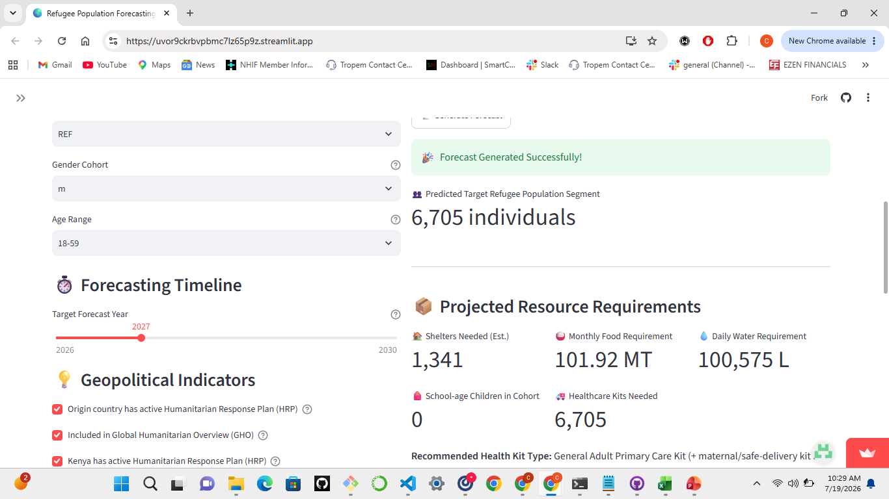

# 🇰🇪 Kenya Refugee Population Forecasting and Humanitarian Resource Planning System


A machine learning-powered decision support system that forecasts refugee and asylum-seeker populations in Kenya and translates those predictions into estimated humanitarian resource requirements, including food, shelter, healthcare, and education.

---

## 🌐 Live Application

**Streamlit App**

[](https://uvor9ckrbvpbmc7lz65p9z.streamlit.app/)

---

# 📑 Table of Contents

* Project Overview
* Business Problem
* Project Objectives
* Dataset
* Repository Structure
* Project Workflow
* Key Findings
* Feature Engineering
* Model Development
* Model Performance
* Why FT-Transformer?
* Streamlit Application
* Technology Stack
* Installation
* Running the Project
* Business Insights
* Limitations
* Future Improvements
* Contributors
* References
* Acknowledgements
* License

---

# 📖 Project Overview

Kenya hosts hundreds of thousands of refugees and asylum seekers displaced by conflict, persecution, political instability, and climate-related disasters across East and Central Africa.

Humanitarian organizations often depend on historical population reports when allocating resources, making it difficult to respond proactively to sudden population increases.

This project applies machine learning and deep learning techniques to forecast refugee populations and estimate humanitarian resource requirements before crises escalate.

The project follows the **CRISP-DM (Cross-Industry Standard Process for Data Mining)** methodology, from business understanding through deployment.

---

# 🎯 Business Problem

Population movements can change rapidly because of:

* Armed conflicts
* Political instability
* Climate shocks
* Economic crises
* Humanitarian emergencies

These fluctuations create uncertainty in planning for:

* Food distribution
* Shelter allocation
* Healthcare services
* Educational support
* Water and sanitation

Without predictive analytics, humanitarian agencies risk delayed responses, inefficient resource allocation, and increased operational costs.

This project provides a data-driven decision-support system for humanitarian organizations and policymakers.

---

# 🎯 Project Objectives

The project aims to:

* Explore refugee population trends in Kenya.
* Identify demographic and geographic patterns.
* Engineer meaningful temporal and demographic features.
* Build and compare multiple machine learning models.
* Forecast refugee populations by demographic characteristics.
* Estimate humanitarian resource requirements.
* Deploy the best-performing deep learning model using Streamlit.

---

# 📊 Dataset

The project uses the **Kenya Refugee and Asylum Population Dataset** obtained through the **Humanitarian Data Exchange Humanitarian API (HDX HAPI)**.

## Dataset Summary

| Attribute              | Value      |
| ---------------------- | ---------- |
| Period Covered         | 2001–2025  |
| Original Records       | 27,664     |
| Records After Cleaning | 8,540      |
| Target Variable        | Population |
| Asylum Location        | Kenya      |

### Main Features

| Feature              | Description                            |
| -------------------- | -------------------------------------- |
| origin_location_code | Refugees' country of origin            |
| population_group     | Refugee population category            |
| gender               | Male or Female                         |
| age_range            | Age category                           |
| year                 | Reporting year                         |
| origin_has_hrp       | Humanitarian Response Plan indicator   |
| origin_in_gho        | Global Humanitarian Overview indicator |
| population           | Recorded refugee population            |

Aggregate age and gender categories were removed to prevent double counting while zero-population records were retained because they may represent valid observations.

---

# 📁 Repository Structure

```
.
├── data/
├── notebooks/
├── models/
│   ├── ft_transformer_model.pth
│   ├── label_encoders.pkl
│   ├── scaler.pkl
│   └── model_config.pkl
├── images/
├── app.py
├── requirements.txt
├── README.md
└── LICENSE
```

---

# 🔄 Project Workflow

The project follows the CRISP-DM framework:

1. Business Understanding
2. Data Understanding
3. Data Cleaning
4. Exploratory Data Analysis
5. Feature Engineering
6. Data Preprocessing
7. Model Development
8. Model Evaluation
9. Deployment
10. Business Insights
11. Recommendations
12. Conclusion

---

# 📈 Key Findings

* Somalia contributes the largest refugee population hosted in Kenya.
* South Sudan represents the second-largest source population.
* Adults aged 18–59 constitute the largest demographic.
* Children account for a substantial proportion of the refugee population.
* Male and female refugee populations are relatively balanced.
* Refugee inflows exhibit nonlinear patterns driven by geopolitical and humanitarian events.
* A small number of origin countries account for most refugee arrivals.

---

# ⚙️ Feature Engineering

Several predictive features were engineered, including:

* Temporal ordering by year
* Population lag features
* Rolling population averages
* Categorical encoding
* Numerical feature scaling
* Feature tokenization for deep learning

These features improved the ability of the models to capture long-term demographic trends.

---

# 🤖 Model Development

The following regression models were developed and evaluated:

* Linear Regression
* Decision Tree Regressor
* Random Forest Regressor
* XGBoost Regressor
* FT-Transformer

Classical machine learning models were built using Scikit-learn and XGBoost, while the deep learning model was implemented in PyTorch.

---

# 📊 Model Performance

| Model             |        MAE |         RMSE |        R² |
| ----------------- | ---------: | -----------: | --------: |
| Linear Regression |   2,174.56 |     5,005.00 |     0.429 |
| Decision Tree     |     484.93 | **2,282.01** | **0.881** |
| Random Forest     | **466.63** |     2,285.70 |     0.881 |
| XGBoost           |     548.37 |     2,373.54 |     0.872 |

Although Random Forest achieved the lowest Mean Absolute Error and Decision Tree achieved the lowest Root Mean Squared Error among the classical models, the project deployed an **FT-Transformer**, which leverages feature tokenization and self-attention to model complex interactions between categorical and numerical variables.

---

# 🧠 Why FT-Transformer?

The FT-Transformer was selected for deployment because it:

* Learns complex feature interactions automatically.
* Processes categorical and numerical variables simultaneously.
* Uses self-attention to identify important relationships.
* Reduces manual feature engineering.
* Represents a modern deep learning approach for structured tabular datasets.
* Can be extended to incorporate additional humanitarian indicators in future work.

---

# 🌍 Streamlit Application

The deployed application allows users to:

* Select demographic information.
* Specify a forecasting year.
* Predict refugee population.
* Estimate food requirements.
* Estimate shelter requirements.
* Estimate healthcare requirements.
* Estimate education requirements.

The application is designed to support humanitarian organizations, policymakers, researchers, and disaster response planners.

---

# 💻 Technology Stack

* Python
* Pandas
* NumPy
* Matplotlib
* Seaborn
* Scikit-learn
* XGBoost
* PyTorch
* SHAP
* Streamlit
* Joblib

---

# 🚀 Installation

Clone the repository

```bash
git clone https://github.com/cynthiakemboi/Machine-learning-Model-on-Refugee-Population-Forecasting-Resource-Planning-System-for-Kenya/tree/main
cd yourrepository
```

Install dependencies

```bash
pip install -r requirements.txt
```

---

# ▶️ Running the Project

Launch the Streamlit application

```bash
streamlit run app.py
```

The application will automatically open in your default web browser.

---



# 💡 Business Insights

The forecasting system enables humanitarian agencies to move from reactive to proactive resource planning.

Potential applications include:

* Forecasting refugee arrivals.
* Planning food procurement.
* Estimating shelter capacity.
* Supporting healthcare logistics.
* Improving education planning.
* Optimizing humanitarian budgets.

---

# ⚠️ Limitations

* Historical data does not include real-time conflict or climate indicators.
* Sudden geopolitical crises may reduce predictive accuracy.
* Small demographic groups contain limited observations.
* Resource estimates are based on generalized humanitarian assumptions.
* Continuous model retraining is required as new data becomes available.

---

# 🚀 Future Improvements

Future work may include:

* Integration of real-time conflict datasets.
* Climate and drought indicators.
* Automated model retraining pipelines.
* Prediction uncertainty intervals.
* Interactive geospatial visualizations.
* Camp-level forecasting.
* Continuous monitoring for model drift.

---

# 👥 Contributors

**Team: XG BOOST BUSTERS**

* Charity Nduati
* Cynthia Jemutai
* Stephen Jilani
* Joy Njeru
* Chris Karagu
* Sylvia Wambui

---

# 📚 References

* Humanitarian Data Exchange (HDX)
* UNHCR Refugee Data Portal
* PyTorch Documentation
* Scikit-learn Documentation
* Gorishniy, Y., Rubachev, I., Khrulkov, V., & Babenko, A. (2021). *Revisiting Deep Learning Models for Tabular Data (FT-Transformer).*

---

# 🙏 Acknowledgements

We gratefully acknowledge:

* Moringa School
* Humanitarian Data Exchange (HDX)
* UNHCR
* Our instructors and mentors
* All members of the **XG BOOST BUSTERS** project team for their collaboration and dedication.

---

# 📄 License

This project is released under the **MIT License**.
